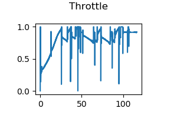

# **Self-Driving Vehicle Control**

## Writeup

---

The goals of this project are the following:
* Implemnet a longitudinal controller to control the throttle and brake.
* Implement a lateral controller to control the steering.
* Use both longitudinal and lateral controllers to drive a car around a track in Carla.

---
### Files

My project includes the following files:
* "controller2d.py" contains a controller object, this is where I implemented my controller.
* "module_7.py" CARLA waypoint follower assessment client script.
* "options.cfg" enable/disable the live plotting which shows the trajectory and controls feedback.
* "grade_c1m7.py" a grading script that compares your trajectory to the waypoints and scores its performance.
* "racetrack_waypoints.txt" contains the path and reference speed for each waypoint in the path.

### Longitudinal controllers
I used a PID controller for my throttle output:

#### p component
throttle proportional to velocity errors:

` v_error = v_desired - v `

` throttle_output = v_error * k_p `

#### I component
Accumulating the velocity errors over time:

` v_int += v_error `

` throttle_output = v_int * k_i * dt `

#### D component
Taking the temporal derivative of the velocity errors:

` v_diff = v_error - pre_v_error `

` pre_v_error = v_error `

` throttle_output = v_diff * k_d / dt `

#### Parameter tuning
For tuning the parameters, check Kevin Lynch's [video](https://bit.ly/2P208OH)
My final hyperparameters is :
` k_p = 2.2 `, ` k_i = 0.36 `, ` k_d = 0.2 `

### Lateral controllers
For lateral controllers, I implemented 2 methods, one is the Pure Pursuit Method, and the other is Stanley Method

#### Pure Pursuit Method
1. Set a look ahead distance(ld). In this porject, I set ld = 5 meters
2. Search for the look ahead point on the reference path. Here, I assume the center of vehicle to rear axle is one meter, then use the vehicle's current position to find the look ahead point on the reference path.
3. Use the look ahead point and current vehicle position to calculate the `alpha_hat`, then `alpha = alpha_hat - yaw`

4. Assign `alpha` to the the steering angle equation.

Here are the result using Pure Pursuit controller:

#### Stanley Method
1. Calculate the cross track error, which is the distance between front axle and the closest point on the reference path
2. Calculate the heading error

3. Assign cross track error and heading error to the steering angle equation.

Here are the result using Stanley controller:

