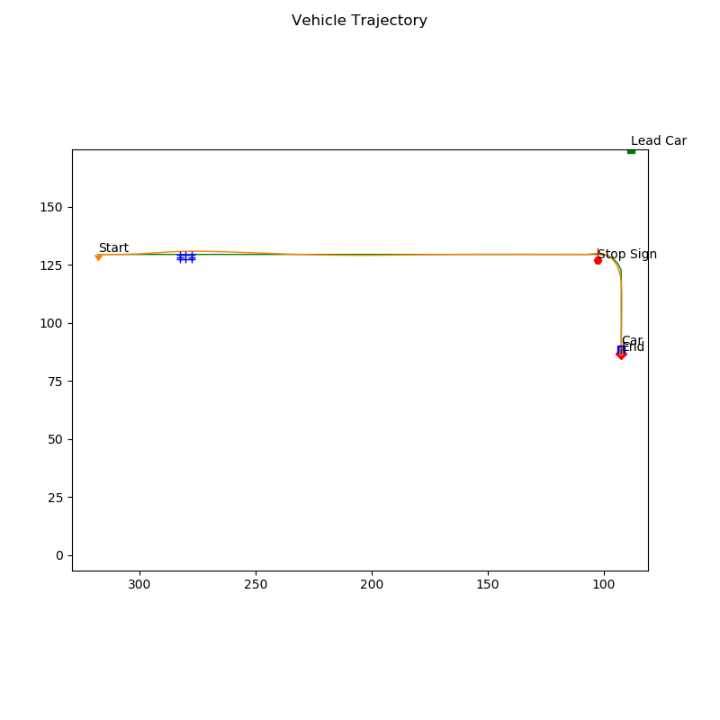

# **Motion Planning on CARLA**

---

The goal of this project is to have a functional motion planning stack that can avoid both static and dynamic obstacles while tracking the center line of a lane, while also handling stop signs in an intersection scenario.

---
### Files

My project includes the following files:
* "behavioural_planner.py" contains a behavioural planner, which will handle a stop sign scenario.
* "collision_checker.py" contains a collision checker, which will select the best path, and eliminate paths that are in collision with obstacles.
* "controller2d.py" contains a controller object.
* "course4_waypoints.txt" contains a set of waypoints
* "local_planner.py" contains a local planner, which will laterally sample paths for collision checker to select the best path.
* "module_7.py" CARLA waypoint follower assessment client script.
* "options.cfg" enable/disable the live plotting which shows the trajectory and controls feedback.
* "path_optimizer.py" contains a path generator, which will generate spiral paths.
* "parked_vehicle_params.txt" contains parked vehicle's information
* "stop_sign_params.txt" contains stop sign coordinate
* "velocity_planner.py" contains a velocity planner, which will not handle all edge cases, but will handle stop signs, lead vehicles, as well as nominal lane maintenance.


### Simulation results
---


[](https://www.youtube.com/watch?v=EDbsbvKTPng "Motion_Planning_on_CARLA")


Here is the result of vehicle trajectory:
(The green line is the ground truth, the orange line is the result trajectory, and the blue thing is the parked vehicle on the road).




### Running the CARLA simulator
First clone this repository and put it under PythonClient directory.

In one terminal, start the CARLA simulator at a 30hz fixed time-step:

**Ubuntu:**

```
/CarlaUE4.sh /Game/Maps/Course4 -windowed -carla-server -benchmark -fps=30
```

**Windows:**

```
CarlaUE4.exe /Game/Maps/Course4 -windowed -carla-server -benchmark -fps=30
```

Note that both the **ResX=<pixel_width>** and **ResY=<pixel_height>** arguments can used to create a fixed size window, if you find the simulation to run too slow. See the CARLA installation guide for more details on how to use the arguments.


### Running the Python client (and controller)

In another terminal, change the directory to go into the "Course4FinalProject" folder, under the "PythonClient" folder.

Run your controller, execute the following command while CARLA is open:

**Ubuntu** (use alternative python commands if the command below does not work, as described in the CARLA install guide)**:**

```
python3 module_7.py
```

**Windows** (use alternative python commands if the command below does not work, as described in the CARLA install guide)**:**

```
python module_7.py
```
