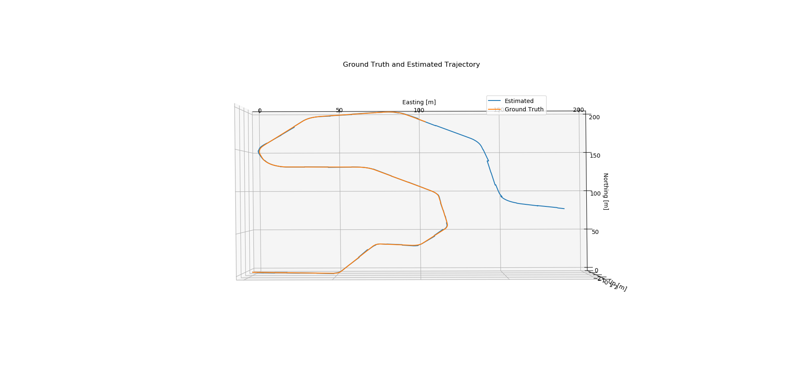
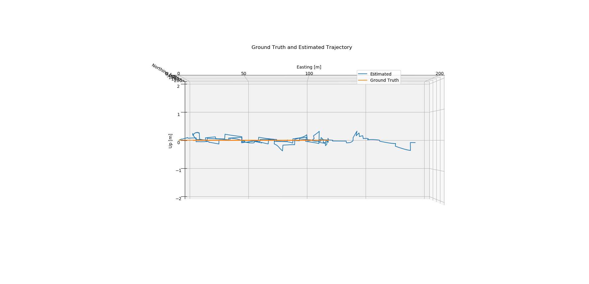

# **Vehicle State Estimation on a Roadway**

## Writeup

---

The goal of this project is to implement a state estimator that fuses the available sensor measurements to provide a reasonable estimate of the vehicle's pose and velocity. Specifically, implementing the Error-State Extended Kalman Filter (ES-EKF), which provides a high degree of robustness, and is a staple in state estimation.

### Files

My project includes the following files:
* "es_ekf.py" this is the file I implemented the Error-State Extended Kalman Filter (ES-EKF) to localize a vehicle.
* "rotations.py" contains a Quaternion class and other rotation-related functions.
* "data folder" contains the data from CARLA simulator for the project

### ES-EKF

In the main kalman filter loop, I first predict the state and the uncertainty using IMU readings, and whenever a GNSS or LiDAR measurement becomes available, I update the kalman gain computation, error state, and covariance.

For part 1 assignment:
The filter relies on IMU data to propagate the state forward in time, and using GPS and LIDAR measurements to correct the state estimate.

Here are the outputs:
      

For part 2 assignment:
Examine the effects of sensor miscalibration on the vehicle pose estimates. Specifically, the transformation between the LIDAR sensor frame and the IMU sensor frame was incorrect, and will result in errors in the vehicle position estimates. Our goal is to adjust the filter parameters (noise variances) to attempt to compensate for these errors.

Here are the outputs before tuning the noise variances:
      

Here are the outputs after adjusting the lidar noise variances:
      

For part 3 assignment:
Explore the effects of all external positioning information (from GPS and LIDAR) is lost for a short period of time. The goal is to illustrate how the loss of external corrections results in drift in the vehicle position estimate, and to understanding how the uncertainty in the position estimate changes when sensor measurements are unavailable.

Here are the outputs before tuning the noise variances:
      

Here are the outputs after adjusting the noise variances:
      

