# **Environment Perception For Self-Driving Cars**

## Writeup

---

The goals of this project are the following:

* Use the output of semantic segmentation neural networks to implement drivable space estimation in 3D.
* Use the output of semantic segmentation neural networks to implement lane estimation.
* Use the output of semantic segmentation to filter errors in the output of 2D object detectors.
* Use the filtered 2D object detection results to determine how far obstacles are from the self-driving car

### 1. Drivable Space Estimation Using Semantic Segmentation Output
#### 1.1 Estimating the 3D (x, y, and z) in camera coordinates from the image:
To do this we need to use the camera intrinsic matrix and the depth map in the following equation:

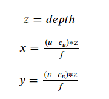

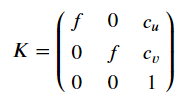

#### 1.2 Estimating The Ground Plane Using RANSAC:
- Step1: process the semantic segmentation output to extract the relevant pixels belonging to the class you want consider as ground. For this assessment, that class is the road class with a mapping index of 7.
- Step2: Choose a minimum of 3 points from xyz_data(3D points belonging to the drivable suface category) at random.
- Step3: Compute the ground plane model using the chosen random points
- Step4: Compute the distance from the ground plane model to every point in xyz_ground, and compute the number of inliers based on a distance threshold(I set it to 0.01).
- Step5: Check if the current number of inliers is greater than all previous iterations and keep the inlier set with the largest number of points.
- Step6: Repeat the loop until number of iterations ≥ a preset number of iterations(I set this to 10), or number of inliers ≥ minimum number of inliers(I set this to number_of_xyz_data*0.99).
- Step7: Recompute the plane model parameters using the final inlier set.

Here is the input RGB image:

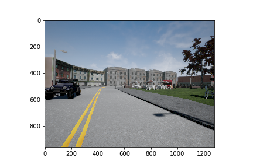

And the output ground mask of drivable space in 2D image:

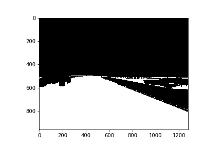

### 2. Lane Estimation Using The Semantic Segmentation Output
#### 2.1 Estimating Lane Boundary Proposals:
This is to estimate any line that qualifies as a lane boundary using the output from semantic segmentation. We call these lines 'proposals'.
- Step1: Create an image containing the semantic segmentation pixels belonging to categories relevant to the lane boundaries. For this assessment, these categories are the lane markings and wide walks which have the value of 6 and 8 in the segmentation output.
- Step2: Perform edge detection using the Canny edge detector.
- Step3: Perform line estimation on the output of edge detection.

Result of estimating lane boundary proposals:

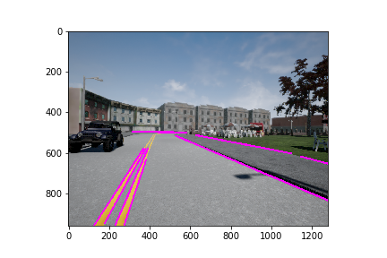

#### 2.2 Merging and Filtering Lane Lines:
This is to merge redundant lines, and filter out any horizontal lines apparent in the image.
- Step1: Calculate the slope and intercept of lines from 'Estimating Lane Boundary Proposals'
- Step2: Filter out lines with slope less than horizontal slope threshold (threshold = 0.3).
- Step3: Iterate over all remaining slopes and intercepts and cluster lines that are close to each other using a slope and intercept threshold.
  For step3:
  1. Create a empty list clusters to store the grouped lines
  2. Loop through every remaining slope and intercept (that have not been filtered out in step2)
  3. For each slope and intercept, loop through the clusters to see if slope and intercept of the lane is close to any of the fist lane in each cluster.
  4. If the slope and intercept are both less than the thresholds (slope threshold = 0.1, intercept threshold = 40), add this lane to this cluster, and break the clusters loop
  5. If this lane was not placed in any cluster in clusters list or the clusters list is empty, create a new cluster where this lane becomes the first element of the cluster
- Step4: Merge all lines in clusters using mean averaging

Result of merging and filtering lane lines:

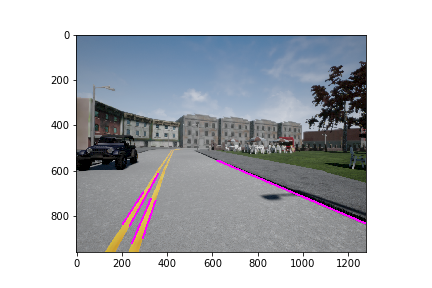

#### 2.3 Extrapolate the lanes to start at the beginning of the road, and end at the end of the road, and to determine the lane markings belonging to the current lane.

The final lane boundaries looks like this:

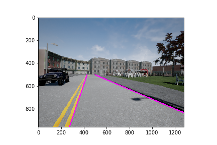

### 3. Computing Minimum Distance To Impact Using The Output of 2D Object Detection.
Since the 2D detections are from a high recall, low precision 2D object detector, we need to use the semantic segmentation output to determine which bounding boxes are valid.

#### 3.1 Filtering Out Unreliable Detections:
- Step1: For each detection, compute how many pixels in the bounding box belong to the category predicted by the neural network. For this assessment, the categories 'Car' and 'Pedestrian'.
- Step2: Devide the computed number of pixels by the area of the bounding box (total number of pixels).
- Step3: If the ratio is greater than a threshold (threshold = 0.3) keep the detection. Else, remove the detection from the list of detections.

The original 2D object detection output looks like this:

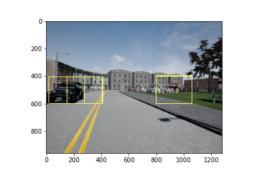

After filtering out Unreliable detections:

#### 3.2 Estimating Minimum Distance To Impact:
- Step1:  For each bounding box, compute the distance to the camera center using the x,y,z in camera coordinates. This can be done according to the equation:
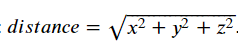

- Step2: Find the value of the minimum distance of all pixels inside the bounding box

Here is the estimated distance along with the 2D detection output:

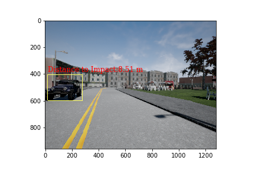

---
#### The result in different image frame:
RGB input image:

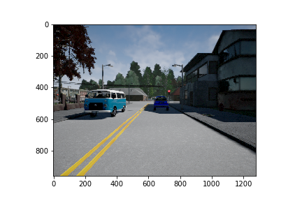

Estimated drivable space:

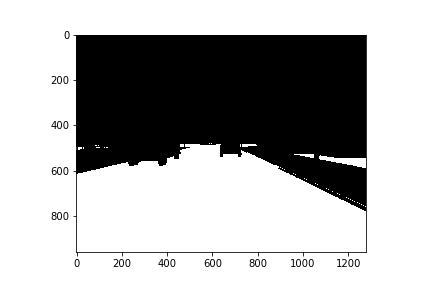

Estimated lane boundaries:

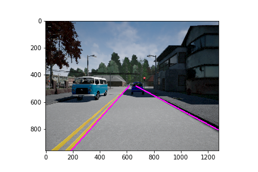

Estimated distance to impact:

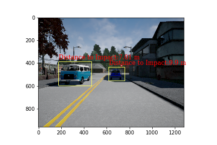
